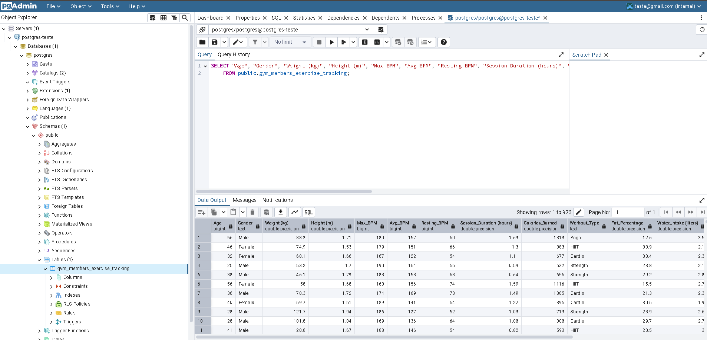

# Docker_Postgres_Ingestion

This project demonstrates how to set up a PostgreSQL database using an official DockerHub image and manage it via the `dpage/pgadmin4` interface. The workflow includes ingesting a Kaggle CSV file through the Kaggle API with Pandas and creating a structured table in PostgreSQL.

## Objective

To showcase the integration of Docker, PostgreSQL, and Kaggle datasets in a practical pipeline for data ingestion and management.

## Project Structure

- `docker-compose.yml`: Docker configuration for PostgreSQL and pgAdmin.
- `Kaggle_Ingestion_Postgres.ipynb`: Jupyter Notebook that handles Kaggle data ingestion and database operations.
- `README.md`: Project documentation.

## Prerequisites

- Docker and Docker Compose installed.
- A [Kaggle](https://www.kaggle.com/) account to access datasets.
- Python with the libraries `pandas`, `sqlalchemy`, and `psycopg2-binary` installed.

## Step-by-Step Guide to Run the Project

1. **Prerequisites**  
   Ensure the following software is installed on your system:
   - Docker: [Installation Guide](https://docs.docker.com/get-docker/)
   - Docker Compose: Usually included in recent versions of Docker Desktop.

2. **Clone or Download the Repository**  
   Retrieve the project files:

   ```bash  
   git clone https://github.com/NathanNonato/Docker_Postgres_Ingestion.git
   cd docker-postgres-project
   ```

3. **Understand the docker-compose.yml File**  
   The docker-compose.yml file defines two services:
   - PostgreSQL: A PostgreSQL database accessible on port 5433.
   - pgAdmin: A web interface for managing PostgreSQL, accessible on port 15432.

4. **Start the Containers**  
   Run the following command to start the services:
   
    ```bash  
   docker-compose up -d
   ```
   
   The -d flag runs the containers in the background. Docker will download the necessary images if they are not already available locally.

5. **Access pgAdmin**  
   - Open your browser and navigate to: http://localhost:15432.
   - Log in using the credentials specified in the docker-compose.yml file:
     - Email: teste@gmail.com
     - Password: postgres
   - After logging in:
     1. Add a new server by clicking on "Add New Server".
     2. Configure the server as follows:
        - Name: Any descriptive name (e.g., Postgres Local).
        - Connection:
          - Host: postgres-teste (the container name from docker-compose.yml).
          - Port: 5432.
          - Username: postgres.
          - Password: postgres.

6. **Verify the Database**  
   In pgAdmin, connect to the server you just configured and verify:
   - The PostgreSQL database is running.
   - You can create and manage tables and schemas.
   - Run all cells in the Kaggle_Ingestion_Postgres.ipynb file to create the table in the local database.
   

7. **Stop and Remove the Containers**  
   When finished, stop and remove the containers by running:
   
   ```bash
   docker-compose down
   ```


